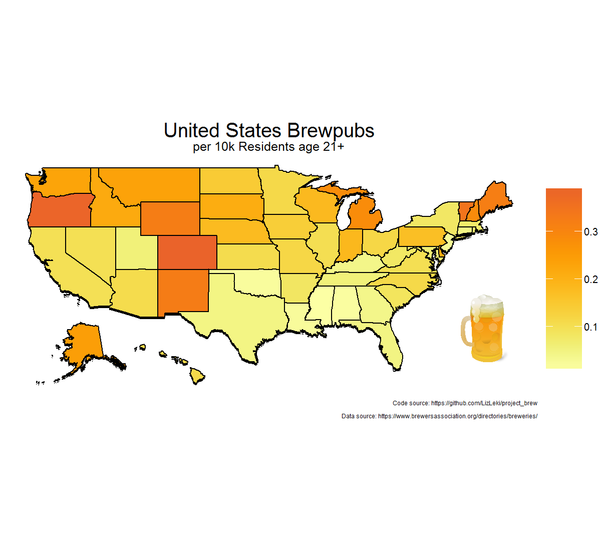
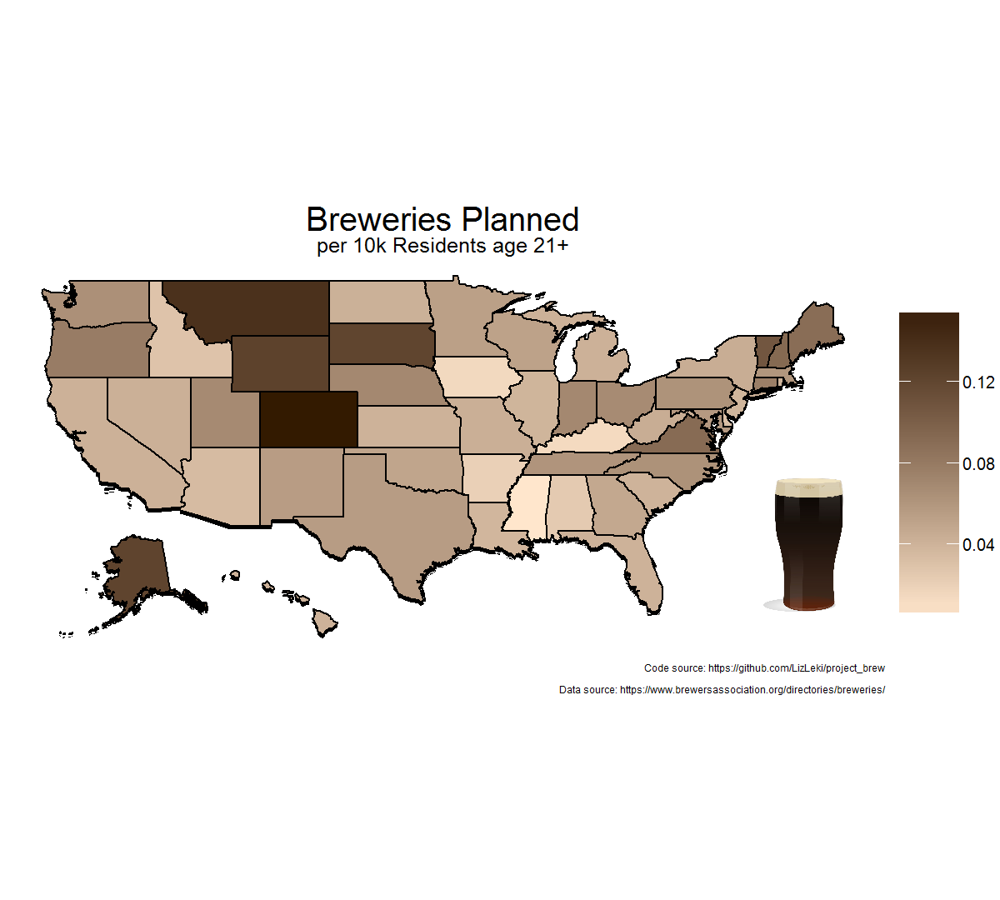

# project_brew
An exploration of craft breweries across the United States.

The most recent data pull was completed on October 30th, 2018. Brewery-level data can be found in all_brews.csv. State-level summary data can be found in state_level_df.csv.

Brewery data scraped from the directory of the [Brewers Association](https://www.brewersassociation.org/directories/breweries/), using a combination of Docker and RSelenium.

### Workflow 
  
  1. Brewery data is acquired as described in brewdata_pull.R
  2. Brewery data is cleaned in brew_cleaning.R
  3. Population data is imported and cleaned in census_data.R
  4. Brewery and population data is combined in data_combos.R
  5. Exploratory tables and visualizations are created in data_explo.R

